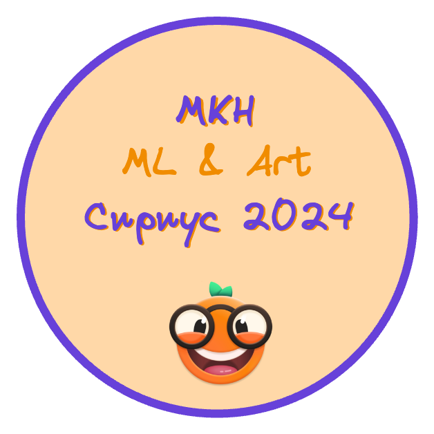
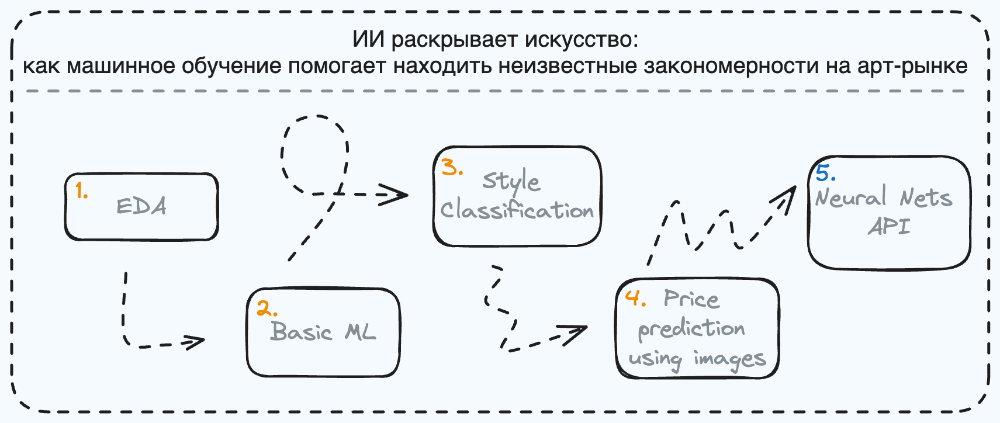

    

# ИИ раскрывает искусство: как машинное обучение помогает находить неизвестные закономерности на арт-рынке
В этом репозитории будут находиться задания для зимней школы СПбГУ для 11-классников, которая будет проходить в Сириусе с 9 по 13 января 2024 года.

## Практические задания

Занятия будут проходить после лекций, в формате 45 минут. Темы занятий будут следующие:
1. EDA: Описательные статистики
2. Feature Engineering + Basic ML
3. В каком стиле написана картина
4. Определяем стоимость по изображению картины
5. Генерируем шедевры

<!--  -->

## Используемые инструменты
На занятиях мы будем использовать разные инструменты:
* [Orange](https://orangedatamining.com/) - инструмент для анализа данных "no code";
* [Python](...) - самый популярный язык программирования для анализа данных и машинного обучения;
* [HuggingFace API](https://huggingface.co/docs/api-inference/quicktour) -  огромная библиотека различных моделей машинного обучения;

## Примеры результатов
Один из пайплайнов, который мы построим в Orange

    

## Авторы курса
* **Лектор**: Дмитрий Алексеевич Григорьев (к.ф.-м.н., доцент кафедры Информатики, Центр ИИ СПбГУ)
* **Ассистент**: Кузнецов Иван

## Ссылки
* [Установка Orange + Туториал по текстовым данным](https://hcommons.org/app/uploads/sites/1001924/2020/07/intro-to-orange-tutorial-part-1.pdf)
