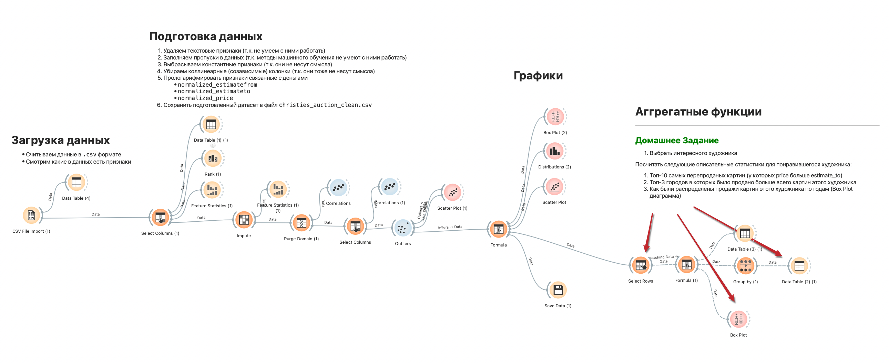

# День 1. Знакомство с Orange. Описательные статистики

    

* Слайды лекции - [уже не тут](https://docs.google.com/presentation/d/1nfrYsqQT7A6zeyeJCd_jAcF7MzWrQyjZxmIybhvLqcg/edit?usp=sharing)
* Слайды практики - [пока еще не тут]()

## Домашнее Задание
0. Выбрать интересного ВАМ художника из датасета

Посчитать следующие описательные статистики для понравившегося художника:
1. Топ-10 его самых перепроданых картин (у которых `normalized_price` больше `normalized_estimateto`)
2. Топ-3 городов в которых было продано больше всего картин этого художника
3. Как были распределены продажи картин этого художника по годам (Box Plot диаграмма)

