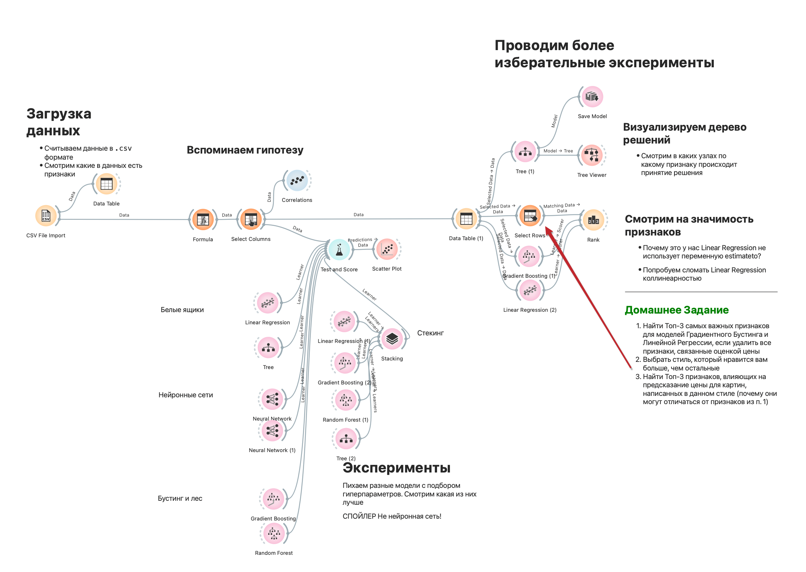

# День 2. Предсказание цен лотов с аукциона Christie’s

    

Материалы курса Дня №2 (презентации, записи занятий) доступны в [Яндекс.Диске](https://disk.yandex.ru/d/jdzIgPvWkKRw7w)

На аукционах товары довольно часто продаются по цене, которая превышает начальную. Один из предметов, которые часто продаются на аукционах - картины.
С помощью Orange мы посмотрим какие есть закономерности у дорогих картин, найдем самые важные признаки для того, чтобы картина стоила дорого:
* проведем Exploratory Data Analysis (EDA) - посмотрим как устроена природа входных данных;
* настроим процесс предсказания финальной цены основываясь на численных данных;
* добавим использование текстов для предсказания цены.

Используя модель, которую мы обучим надо будет попробовать предсказать наиболее перспективные лоты с предстоящих торгов.

* посмотрим как оценить результат нашей модели
* как посмотреть на сколько коллинеарность и вправду нам мешала
* какие методы для вставки пропусков помогают, а какие делают результат хуже
* что такое stacking? оценим результаты 

## Домашнее задание
Вчера вы выбирали художника, который вам понравился больше всего. Сегодня можно пойти двумя путями:

1. Найти Топ-3 самых важных признаков для моделей Градиентного Бустинга и Линейной Регрессии, если удалить все признаки, связанные c оценкой цены
2. Выбрать стиль, который нравится вам больше, чем остальные
3. Найти Топ-3 признаков, влияющих на предсказание цены для картин, написанных в данном стиле (почему они могут отличаться от признаков из п. 1)